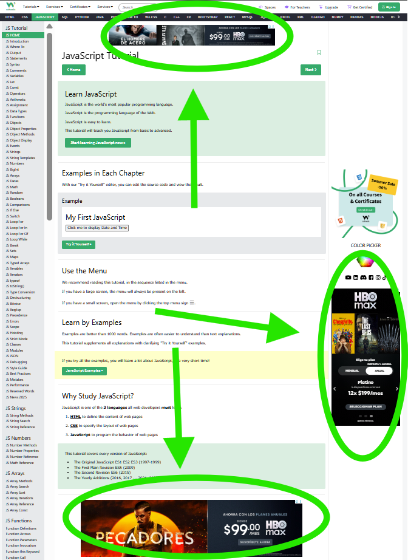
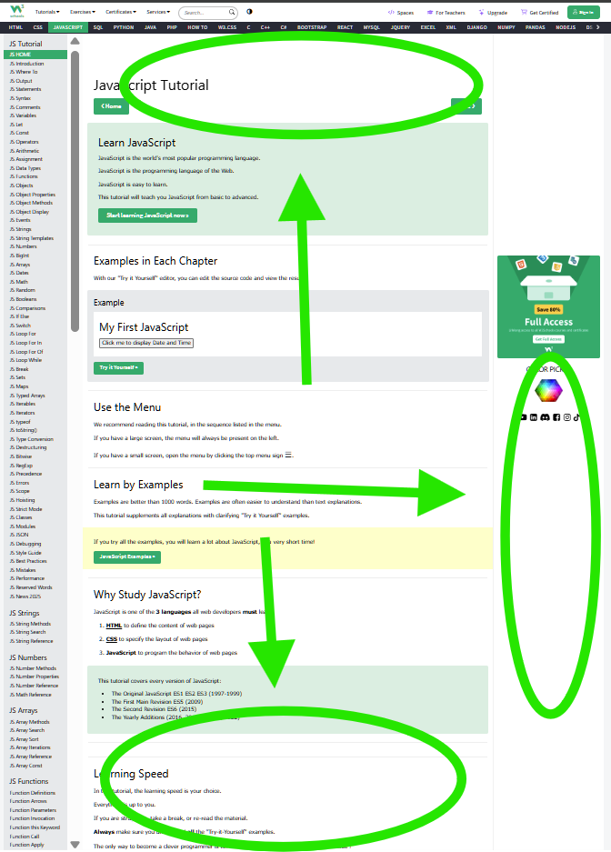

# A Simple and Effective "Add Blocker"

In Google's new Web 3, the famous "Add Blocker" extensions have already been restricted, meaning they were banned from the Google Play Store. But there are still solutions.
One of them is to install a stable version of Google Chrome for a while and avoid updating by configuring the browser's own `chrome://flags` flags. However, this has its risks, and not many days ago, a couple of very strong `0 days` were published in all browsers that use the `Chromium` web engine.

The second solution, and although it may not seem or sound like it, is to write your own "Add Blocker" application/extension. Reading the new `Web 3` standardization on the `Google Developers` site, it is very simple, and to date, up to 70-80% of annoying ads on public pages can be blocked. This depends entirely on the list of rules you have.

And you might say that's the same as using traditional extensions, but the truth is, it's not.

While this project only addresses the issue from that perspective, now the extensibility of your project as an "Ad Blocker" can block elements from a defined URL. For example, if you already know what techniques like XSS are and the conventions with which they are implemented, you can declare it in your rules file, and these elements will not be allowed to execute or function. I'm not saying it's a cure for cancer, but it is something very different.

*Below are the images when it's enabled and when it's not.*

## Scope of this project

According to the Google Developers documentation, using the new `chrome.declarativeNetRequest` function and the `chrome.declarativeContent` function, you can block URLs and the content that a page serves, for example, the page's "Subscribe to the Newsletter" field.

## Snippet part of the code:

### Manifest dot `json` (manifest.json):

```json
{
    "manifest_version": 3,
    "name": "Simple Ad Blocker",
    "version": "1.0.0",
    "permissions": [
        "declarativeNetRequest"
    ],
    "declarative_net_request": {
        "rule_resources": [
            {
                "id": "ruleset_1",
                "enabled": true,
                "path": "rules.json"
            }
        ]
    }
}
```

### And here the snippet of the rules dot `json` (rules.json)

```json
[
    {
        "id": 1,
        "priority": 1,
        "action": {
            "type": "block"
        },
        "condition": {
            "urlFilter": "*://*doubleclick.net/*"
        }
    },
    {
        "id": 2,
        "priority": 1,
        "action": {
            "type": "block"
        },
        "condition": {
            "urlFilter": "*://*googleadservices.com/*"
        }
    }
]
```

The snippet only includes two example URLs, but the file that will be used in the browser already includes 11 URLs.

#### SCREENSHOT's

##### Disabled



##### Enabled



<br>

> [!warning]
> IN MY TESTS WITH THE PAGES I VISIT REGULARLY
> YOUTUBE DOES NOT LIKE IT **ABSOLUTELY AT ALL** WHEN YOU USE ANY KIND OF
> ADBLOCKER. IT'S THE ONLY SITE WHERE I'VE EXPERIENCED
> PROBLEMS. And by problems, I mean, but not limited to:
> - 5 consecutive ads
> - AVERAGE 2-MINUTE AD LENGTH
> - IF YOU GENERATE CONTENT AND/OR HAVE A CHANNEL, YOUTUBE STUDIO WILL ACT AS IF IT HAD A SEIZURE. UPLOADING VIDEOS HAS AN INFINITE LOOP. YOUR PLAYLISTS, FOR SOME REASON, WENT ON VACATION AND ARE EMPTY, OR THERE'S NOTHING ON THE PLAYLIST ANYMORE. IT'S AS IF YOUR WIFE CAME ACROSS YOU WITH YOUR LOVER IN CUBA AND YOU CAME BACK TO PICK UP YOUR CLOTHES THROWN ALL OVER THE BLOCK.

**DISCLAIMER**
This project is a hobby, and under no circumstances am I responsible if any site blocks you or terminates your account. This project was intended to help me learn about the new Web3.